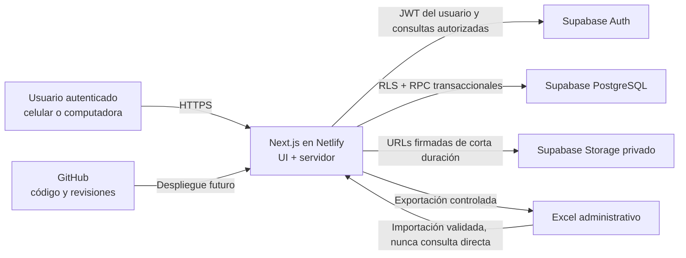

# Arquitectura técnica

## Alcance

JOR Store Operaciones es una aplicación web privada, responsive y móvil primero. Next.js entrega la interfaz y la capa de servidor; Supabase concentra autenticación, PostgreSQL y almacenamiento; GitHub conserva el historial; Netlify alojará la aplicación en una etapa futura. Las integraciones reales de las Etapas 1, 2 y 3 están validadas y sus migraciones 001, 002, 003 y 004 están aplicadas local y remotamente.

## Vista general

## Capas y responsabilidades

### Frontend

- Rutas, layouts y componentes de servidor en `src/app`.
- Componentes interactivos mínimos en el navegador, marcados con `"use client"`.
- Formularios con React Hook Form; Zod valida forma, tipos y mensajes tempranos.
- Muestra fechas en `America/Lima` e importes en PEN.
- Nunca decide autorizaciones, calcula totales definitivos ni modifica balances directamente.
- El cliente de navegador usa exclusivamente URL y clave anónima; no importa módulos administrativos.

### Servidor Next.js

- Route Handlers y Server Actions coordinan casos de uso y verifican sesión/rol.
- Obtiene datos con el JWT del usuario para que RLS siga siendo efectiva.
- Puede ejecutar procesos administrativos controlados con `service_role` solo en runtime de servidor y con autorización explícita.
- Genera importaciones/exportaciones con ExcelJS, límites de tamaño y reportes de rechazo.
- No reemplaza las transacciones críticas de PostgreSQL con múltiples llamadas independientes.
- `src/proxy.ts` renueva cookies con `@supabase/ssr` y hace una primera decisión de ruta; cada layout/página sensible vuelve a autorizar en servidor.
- Las acciones administrativas verifican la sesión y el rol antes de aceptar el rol/estado solicitado por la interfaz.

### Supabase

- Auth emite y renueva sesiones; el registro público permanece desactivado.
- PostgreSQL es la fuente oficial de verdad y aplica claves, checks, unicidad, RLS y funciones transaccionales.
- Funciones `security definer`, cuando sean imprescindibles, fijan `search_path`, validan rol y tienen permisos mínimos.
- Storage conserva comprobantes e imágenes en buckets privados; el acceso se concede mediante políticas y URLs firmadas.
- Los catálogos usan RLS para que el administrador activo lea todo y escriba, mientras el operador activo solo lee filas activas. Triggers normalizan, protegen campos de auditoría, validan relaciones y escriben `audit_logs` dentro de la misma transacción.

### GitHub y Netlify

- GitHub conserva código, documentación y migraciones, nunca datos operativos ni secretos.
- `main` será estable y `desarrollo` integrará etapas; los despliegues no se configuran en Etapa 0.
- Netlify ejecutará build y hospedará Next.js en el futuro. Sus variables cifradas reemplazarán valores locales, sin incluirlas en el repositorio.

## Flujo de datos

1. El usuario inicia sesión mediante Supabase Auth.
2. El servidor recibe una sesión verificable y opera con el JWT del usuario.
3. Lecturas simples pasan por consultas sujetas a RLS.
4. Una operación crítica llama una única función PostgreSQL transaccional.
5. La función bloquea filas afectadas, valida estado/stock, actualiza agregados, inserta movimientos/auditoría y confirma o revierte todo.
6. Next.js invalida datos almacenados en caché y responde con un resultado seguro para la interfaz.

## Flujo de autenticación SSR implementado

1. `src/proxy.ts` crea un cliente Supabase por solicitud con cookies `getAll/setAll`.
2. `getClaims()` valida la identidad y renueva tokens cuando corresponde; los encabezados de no-caché acompañan cualquier cookie renovada.
3. Las rutas `/app/**` exigen sesión y `current_user_is_active()`; `/app/usuarios` exige además `administrator`.
4. El layout privado llama nuevamente `getUser()` y consulta perfil/rol bajo RLS. Proxy no es la única defensa.
5. Login, recuperación, callback y cambio de contraseña se ejecutan en servidor. Las redirecciones se reducen a una lista interna cerrada.
6. Un usuario inactivo, aunque conserve una cookie, no supera RLS ni el control de servidor.

### Clientes Supabase

| Cliente | Archivo | Clave | Uso |
| --- | --- | --- | --- |
| Navegador | `src/lib/supabase/client.ts` | anónima | Interacción cliente futura bajo RLS |
| Servidor SSR | `src/lib/supabase/server.ts` | anónima + JWT usuario | Server Components, acciones y RPC autorizadas |
| Administrativo | `src/lib/supabase/admin.ts` | `service_role` | Solo Auth Admin para invitaciones |

El cliente administrativo importa `server-only`, desactiva persistencia/refresh y nunca se serializa. Cambios de rol/estado no usan `service_role`: llaman RPC `security definer` con el JWT del administrador, de modo que PostgreSQL verifica actor y registra auditoría.

No se usará `localStorage` como base de datos. La caché del cliente, si se incorpora, será descartable y nunca la autoridad.

## Variables de entorno

- `.env.example` enumera nombres sin valores reales y sí se versiona.
- `.env.local` contiene valores locales, está ignorado y nunca se comparte.
- `NEXT_PUBLIC_SUPABASE_URL` y `NEXT_PUBLIC_SUPABASE_ANON_KEY` pueden llegar al navegador; la clave anónima depende de RLS.
- `SUPABASE_SERVICE_ROLE_KEY` es exclusivamente de servidor, nunca se referencia desde módulos cliente.
- `NEXT_PUBLIC_APP_URL` identifica el origen permitido para redirecciones.
- `APP_TIMEZONE=America/Lima` fija la zona de negocio.
- La validación se ejecuta cuando una funcionalidad necesita las variables, no al importar módulos. Por ello CI puede compilar sin secretos; una acción real falla con un mensaje que enumera solo nombres faltantes.

## Límites de responsabilidad

| Componente | Hace | No hace |
| --- | --- | --- |
| Navegador | Presenta, captura, valida UX | Autorizar, custodiar secretos, confirmar stock |
| Next.js servidor | Verifica sesión, coordina casos, transforma respuestas | Persistir como fuente oficial o simular transacciones |
| PostgreSQL | Garantiza integridad, RLS, transacciones, auditoría | Renderizar UI o aceptar datos sin restricciones |
| Storage | Custodia archivos privados | Guardar datos relacionales o servir archivos públicamente |
| Excel | Importar/exportar administrativamente | Ser base viva o mecanismo de concurrencia |
| GitHub | Versionar código y migraciones | Guardar clientes, respaldos, `.env` o adjuntos |

## Estructura y evolución

Los módulos se organizan por dominio en `src/features`; las consultas de catálogos viven en `src/services/catalogs`, sus esquemas en `src/validations/catalogs.ts`, los tipos en `src/types/catalogs.ts` y las rutas/composición en `src/app/app`. Las lecturas son Server Components paginados y las mutaciones Server Actions con JWT del usuario, sin `service_role`. Las migraciones SQL son secuenciales e inmutables. Se añadirá PWA solo en Etapa 7.

## Estado de integración

Las migraciones 001 y 002 de Etapa 1, la migración 003 de Etapa 2 y la migración 004 de Etapa 3 están aplicadas en el Supabase real de desarrollo. Productos, variantes, almacenes, ubicaciones, proveedores, compras, recepciones, balances, movimientos, transferencias y ajustes fueron validados manualmente con datos ficticios. El costo promedio ponderado y la conversión explícita de `America/Lima` a UTC fueron verificados. Las pruebas reales de concurrencia con conexiones independientes continúan pendientes. La Etapa 4 todavía no ha sido iniciada y no existe despliegue Netlify.

## Implementación de Etapa 3

La migración 004, aplicada local y remotamente, añade compras, líneas, balances, movimientos, transferencias y sus líneas. Las lecturas viven en `src/services/inventory`, se paginan a 20 filas y resuelven relaciones en lotes. Las mutaciones viven en Server Actions y usan el cliente SSR con JWT; `service_role` no participa.

Los borradores admiten solo las columnas comerciales concedidas. Confirmar, cancelar, recibir, despachar y ajustar son RPC `security definer` con `search_path` vacío y autorización interna. `private.apply_inventory_movement` crea o bloquea el balance, valida disponible, aumenta `version`, calcula costo y crea exactamente un movimiento en la misma transacción. Una tabla privada de comandos correlaciona clave, actor, operación y hash del payload para repetir el mismo resultado o rechazar reutilizaciones incompatibles.

La transferencia bloquea y procesa balances origen en orden `ubicación, variante, línea`; la salida no crea stock en destino. Cada recepción bloquea cabecera, línea y balance destino. La conciliación administrativa es de solo lectura. Pedidos y operaciones de reserva permanecen fuera del modelo público.
