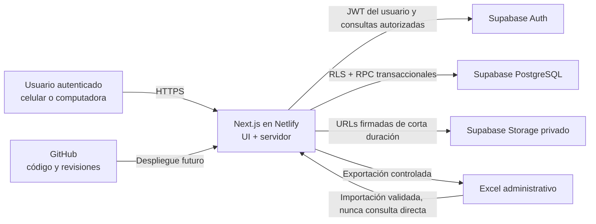

# Arquitectura técnica

## Alcance

JOR Store Operaciones será una aplicación web privada, responsive y móvil primero. Next.js entregará la interfaz y la capa de servidor; Supabase concentrará autenticación, PostgreSQL y almacenamiento; GitHub conservará el historial; Netlify alojará la aplicación en una etapa futura. La Etapa 0 no conecta servicios reales.

## Vista general

## Capas y responsabilidades

### Frontend

- Rutas, layouts y componentes de servidor en `src/app`.
- Componentes interactivos mínimos en el navegador, marcados con `"use client"`.
- Formularios con React Hook Form; Zod valida forma, tipos y mensajes tempranos.
- Muestra fechas en `America/Lima` e importes en PEN.
- Nunca decide autorizaciones, calcula totales definitivos ni modifica balances directamente.

### Servidor Next.js

- Route Handlers y Server Actions coordinan casos de uso y verifican sesión/rol.
- Obtiene datos con el JWT del usuario para que RLS siga siendo efectiva.
- Puede ejecutar procesos administrativos controlados con `service_role` solo en runtime de servidor y con autorización explícita.
- Genera importaciones/exportaciones con ExcelJS, límites de tamaño y reportes de rechazo.
- No reemplaza las transacciones críticas de PostgreSQL con múltiples llamadas independientes.

### Supabase

- Auth emite y renueva sesiones; el registro público permanece desactivado.
- PostgreSQL es la fuente oficial de verdad y aplica claves, checks, unicidad, RLS y funciones transaccionales.
- Funciones `security definer`, cuando sean imprescindibles, fijan `search_path`, validan rol y tienen permisos mínimos.
- Storage conserva comprobantes e imágenes en buckets privados; el acceso se concede mediante políticas y URLs firmadas.

### GitHub y Netlify

- GitHub conserva código, documentación y migraciones, nunca datos operativos ni secretos.
- `main` será estable y `desarrollo` integrará etapas; los despliegues no se configuran en Etapa 0.
- Netlify ejecutará build y hospedará Next.js en el futuro. Sus variables cifradas reemplazarán valores locales, sin incluirlas en el repositorio.

## Flujo de datos

1. El usuario inicia sesión mediante Supabase Auth.
2. El servidor recibe una sesión verificable y opera con el JWT del usuario.
3. Lecturas simples pasan por consultas sujetas a RLS.
4. Una operación crítica llama una única función PostgreSQL transaccional.
5. La función bloquea filas afectadas, valida estado/stock, actualiza agregados, inserta movimientos/auditoría y confirma o revierte todo.
6. Next.js invalida datos almacenados en caché y responde con un resultado seguro para la interfaz.

No se usará `localStorage` como base de datos. La caché del cliente, si se incorpora, será descartable y nunca la autoridad.

## Variables de entorno

- `.env.example` enumera nombres sin valores reales y sí se versiona.
- `.env.local` contiene valores locales, está ignorado y nunca se comparte.
- `NEXT_PUBLIC_SUPABASE_URL` y `NEXT_PUBLIC_SUPABASE_ANON_KEY` pueden llegar al navegador; la clave anónima depende de RLS.
- `SUPABASE_SERVICE_ROLE_KEY` es exclusivamente de servidor, nunca se referencia desde módulos cliente.
- `NEXT_PUBLIC_APP_URL` identifica el origen permitido para redirecciones.
- `APP_TIMEZONE=America/Lima` fija la zona de negocio.

## Límites de responsabilidad

| Componente | Hace | No hace |
| --- | --- | --- |
| Navegador | Presenta, captura, valida UX | Autorizar, custodiar secretos, confirmar stock |
| Next.js servidor | Verifica sesión, coordina casos, transforma respuestas | Persistir como fuente oficial o simular transacciones |
| PostgreSQL | Garantiza integridad, RLS, transacciones, auditoría | Renderizar UI o aceptar datos sin restricciones |
| Storage | Custodia archivos privados | Guardar datos relacionales o servir archivos públicamente |
| Excel | Importar/exportar administrativamente | Ser base viva o mecanismo de concurrencia |
| GitHub | Versionar código y migraciones | Guardar clientes, respaldos, `.env` o adjuntos |

## Estructura y evolución

Los módulos se organizan por dominio en `src/features` y dependen de servicios y tipos compartidos, no unos de otros de forma circular. Las migraciones SQL serán secuenciales e inmutables. Se añadirá manifiesto PWA, service worker y estrategia offline solo en la Etapa 7; ninguna operación crítica se confirmará offline.
